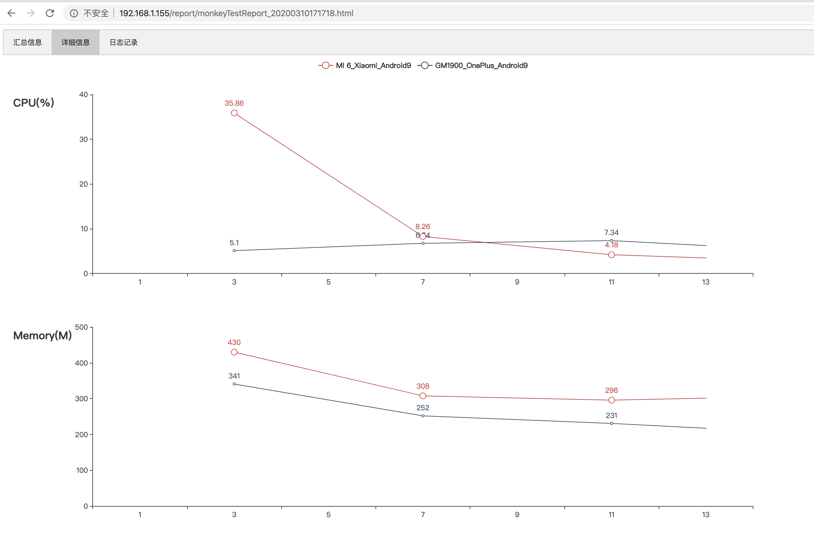
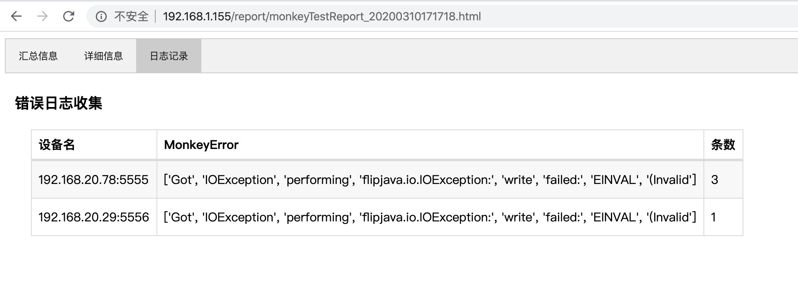

### Android monkey test for mac , linux

##安装
- pip3 install -r requirement.txt

##配置
- 配置文件位于: conf/config.yml 。

adb 无线连接配置：		
&#8195;		1. 先使用数据线连上手机。 保证adb devices存在设备。并记录手机wifi ip 	
&#8195;		2. adb tcpip 5555 	
&#8195;		3. 拔掉数据线。 adb connect ip:5555

同时多机运行: 配置在devList里

##运行
- python3 monkeyTest_runner.py

##html 报告
- 报告生成路径: report/monkey  一份excel，一份html
- 

- 

- 